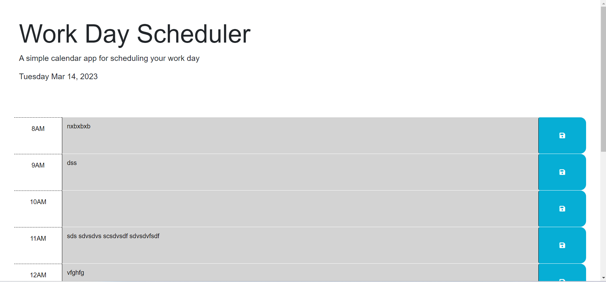
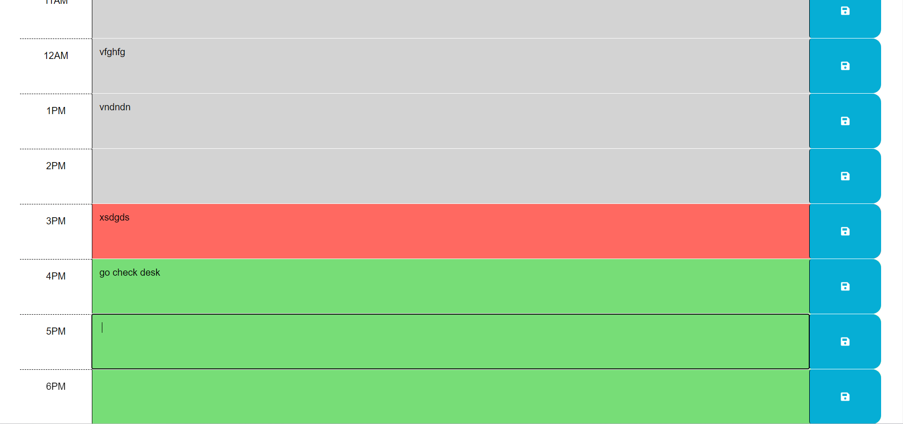
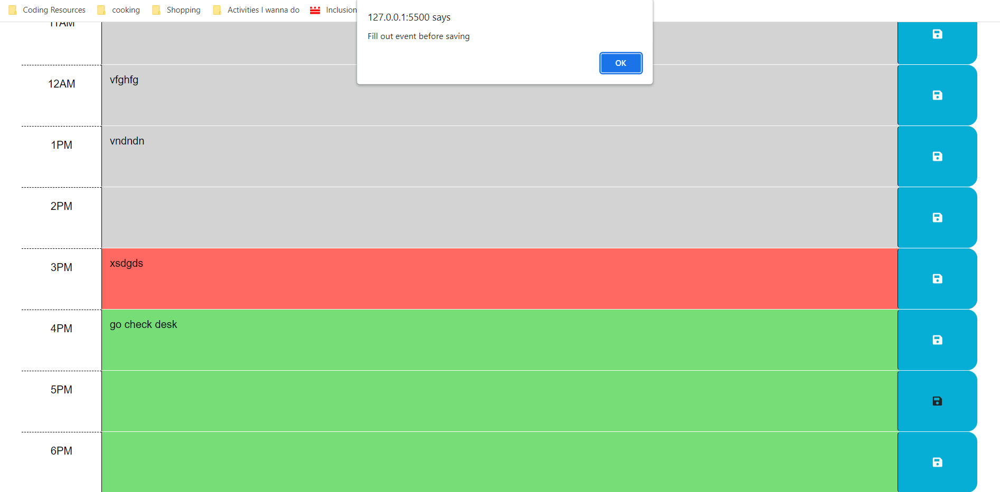

# Daily Planner

## Description

Provide a short description explaining the what, why, and how of your project. Use the following questions as a guide:

- Planners are great tools for making an efficient schedule so this is one designed to store your daily events and update you on the time block you are in
- Learned about jquery and localStorage and how to incorporate them to make coding more efficient

## Usage

-This is the top of the website. The date it centered on the screen in the header

-When the time block is grey that means it has passed that time. When it is green that is the future and the present is represented by red
-If you type into the text box it will store you input after clicking the save button on the right hand side

-If you don't fill in the input and try to save you will get an alert telling you to write something before you save

## Access
-github repo - https://github.com/QDatcher/module5assignment-planner
-live website - https://qdatcher.github.io/module5assignment-planner/

